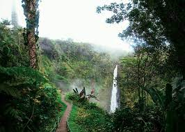

# sqlalchemy-challenge

## Description
Climate analysis of Hawaii

## Table of Contents

- [Usage](#usage)
- [Credits](#credits)
- [License](#license)

- [Contact](#contact)

## Usage
This project can be used by anyone who wants to visit the Hawaii islands. Travelers, developers, and more. 

## Credits
Geronimo Perez

## Contact
If there are any questions of concerns, I can be reached at:
##### [github: velvetklr](https://github.com/velvetklr)
##### [email: velvetklr@gmail.com](mailto:velvetklr@gmail.com)
